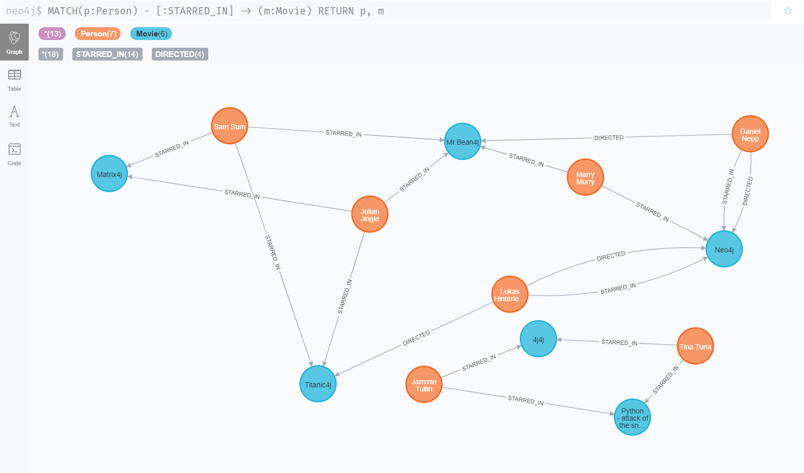

# Neo4j - Pure awesomeness! #

This repository hosts a jupyter presentation for the graph-database technology called "Neo4j"! 
Take a look : 

> ## [A jupyter notebook journey into a better database world! <3 ](neo4j-practice/neo4j_demo.ipynb) ##

